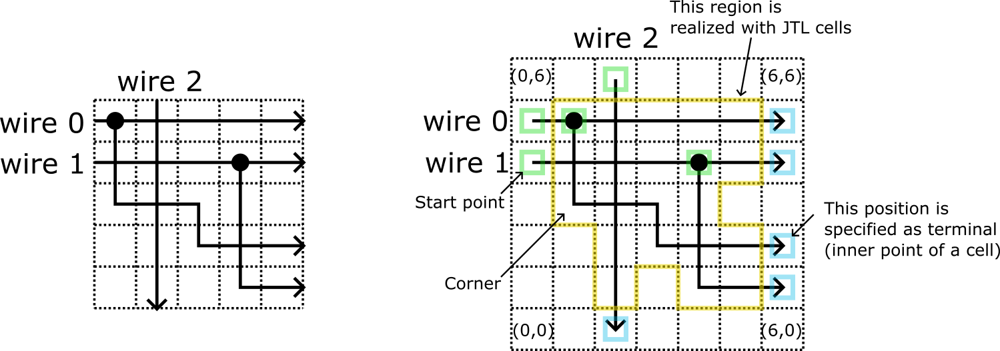

# JTLCellPlacer

A tool for tiling JTL cells according to given information.

## Usage

Users need a file containing path information. The tool formulated the problem to tile JTL cells according to the given paths as an ILP problem.
Sample code "example.route" considers following JTLs.



Following command converts the sample code into an formulated problem in LP format.
```
$ ./genlp.sh example.route
```
A formulated ILP problem is obtained as "wire2cell.lp". The next tool invokes an ILP solver and generates a resultant tiling information. 

```
$ ./runsolver.sh wire2cell.lp
```

wire2cell.skill is the generated output. It is a Cadence SKILL script to insert cell instances to a layout.

Though currently additional constraints and an objective cannot be specified in the input file,
adding constraints and changing an objective function are possible by changing program codes.

A PDF manual for the tool is also available. Please contact me if it is needed.

## Reference 

- "Automatic Cell Placement for Josephson Transmission Lines in Cell-Based Layout Design Environment for RSFQ Circuits", ISS2023, ED-8-3, Nov. 2023. 
